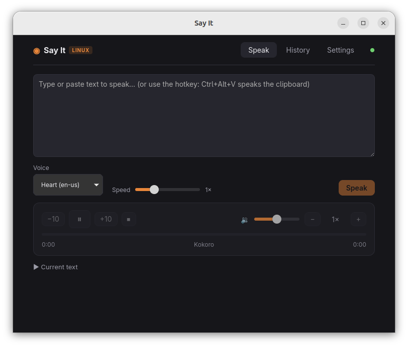

# Say It

[](https://github.com/ildella/sayit/actions/workflows/ci-linux.yml)
[](https://github.com/ildella/sayit/actions/workflows/ci-macos.yml)
[](https://github.com/ildella/sayit/actions/workflows/ci-windows.yml)

Private, local text-to-speech. Say It turns copied text into speech with open
models running entirely on your machine — your text and generated audio never
leave your computer.

This is a Linux-first port of [callebtc/sayit](https://github.com/callebtc/sayit)
(macOS / Apple silicon). It keeps the original architecture and CLI while
replacing Apple-specific layers with Tauri, Svelte, and kokoro-js.

<p align="center">
  
</p>

Linux (X11 and Wayland) is built and tested. Windows CI builds an experimental
MSI (needs Node and mpv on the machine; playback is not a full Windows port).
macOS should compile; help wanted.

## Highlights

- **Speak from anywhere.** Copy text and press the clipboard hotkey
  (**Ctrl+Alt+V** on X11), or bind `sayit-clipboard` as a custom shortcut in
  your desktop environment — the reliable path on Wayland.
- **A desktop player.** Tray window to speak, pause, seek, change playback
  speed, and revisit history without leaving your current app.
- **Open models.** Download supported Kokoro-82M weights in the app or CLI
  (`kokoro-q8` ~90 MB, or `kokoro-q4`). Speak never downloads on its own.
- **Efficient model loading.** Only one model is kept in memory, and it is
  unloaded after a configurable idle period (ten minutes by default).
- **Local by design.** Synthesis works offline after model download. There is
  no analytics, cloud inference, or passive clipboard monitoring.
- **Hear your coding agent work.** The bundled
  [Say It agent skill](skills/sayit/SKILL.md) provides live, hands-free spoken
  progress updates while an agent works.

## Getting started

Two products, one engine. The CLI installer never needs a window. The GUI
package includes its own copy of the sidecar and talks to whatever is already
on port 7878.

### CLI (no window)

Needs **Node ≥ 20**, npm, and **mpv** (`aplay` is a limited fallback).
Clipboard tools (`wl-paste`, `xclip`, or `xsel`) only if you want the hotkey.

```sh
curl -fsSL https://raw.githubusercontent.com/ildella/sayit/master/scripts/install.sh | bash -s -- --systemd
```

Or from a clone: `bash scripts/install.sh --systemd`. Omit `--systemd` to
start the daemon once without enabling it. Put `~/.local/bin` on your `PATH`.

Then download a model (once, then the app stays offline) and speak:

```sh
sayit models install kokoro-q8 --use
sayit "Hello from Say It"
```

Or copy text and run `sayit-clipboard` (bind that in your desktop
shortcuts). Speak returns an error until a catalog model is installed
and selected.

### Desktop app

The Linux GUI is an **AppImage**. It embeds the sidecar. Needs **Node ≥ 20**
and **mpv** on the machine (same as the CLI). No sudo. Tags also publish an
experimental **Windows MSI** (same Node + mpv requirement; not a full Windows
port).

Download it from
[Releases](https://github.com/ildella/sayit/releases), then:

```sh
chmod +x SayIt-*.AppImage
./SayIt-*.AppImage
```

The window binary is `sayit-desktop`; it does not replace the CLI `sayit`.
You can run both: whoever starts first owns port 7878; the other connects.

Auto-update (Settings → Check for updates) applies to the AppImage and the
experimental Windows MSI. `.deb` / `.rpm` stay distro packages.

### Terminal

The install includes a `sayit` CLI for speech, playback, models, and
automation:

```sh
sayit "Read this aloud"
printf 'Read standard input' | sayit
sayit status
sayit pause
sayit resume
sayit volume 0          # silence; 1 = normal, 2 = boost
sayit service status
sayit skill path
```

Run `sayit --help` for all commands. The CLI talks to the sidecar on
`127.0.0.1:7878`. If the daemon is down: `sayit service start` (or
`systemctl --user start sayit` after `--systemd`).

### Coding-agent voice mode

After install:

```sh
sayit skill install
```

That copies `SKILL.md` to `~/.agents/skills/sayit/` (OpenCode and other
agents that read that directory). Then tell the agent:

```text
Load the Say It skill and use it for live spoken updates.
```

**Claude Code** (if you use it instead):

```sh
mkdir -p ~/.claude/skills/sayit
cp "$(sayit skill path)" ~/.claude/skills/sayit/SKILL.md
```

Re-run `sayit skill install` after upgrading Say It. The sidecar must be
running and a model installed before speech works.

### Wayland vs X11

In-app global shortcuts (**Ctrl+Alt+V**) work on X11. Wayland compositors
block them — bind a **custom shortcut** in your desktop settings to
`sayit-clipboard` (installed next to the CLI). There is no cross-compositor
API for another app's *selection* (not clipboard); on X11 you can point
`sayit-clipboard` at `xclip -o` (PRIMARY) instead.

## Build from source

Contributors: live UI. The end-user GUI package is the AppImage.

You need Rust and [Tauri's prerequisites](https://v2.tauri.app/start/prerequisites/)
as well as Node ≥ 20 and mpv.

```sh
git clone https://github.com/ildella/sayit.git && cd sayit
npm run setup              # sidecar + CLI into ~/.local (same as install.sh)
npm install                # @tauri-apps/cli
npm --prefix app install   # SvelteKit UI
npm run dev                # live UI (developer loop, not a distribution)
```

If a daemon is already listening on port 7878, Tauri connects to it instead
of spawning a second one.

```sh
npm run build:appimage     # AppImage with sidecar inside (Linux CI)
npm run build:linux        # .deb (optional)
npm run build:msi          # MSI with sidecar inside (Windows CI; Windows host)
npm run build:ci           # compile the shell, skip installers (macOS CI)
```

After pulling updates, re-run `npm run setup` and restart the service so a
CLI install is not talking to a stale sidecar.

## Architecture

The SvelteKit frontend (in a Tauri v2 tray shell) is separate from a
per-user Node sidecar that owns model downloads, synthesis, playback, and
history. The app, CLI, and `sayit-clipboard` talk to that service over a
token-protected REST + SSE API bound to `127.0.0.1:7878`. There is no
Python; synthesis is **Kokoro-82M** via kokoro-js / onnxruntime-node (CPU).

```
┌──────────────┐   REST + SSE, Bearer token   ┌──────────────────┐
│ Tauri v2 app │ ◄──────────────────────────► │ sidecar (Node)   │
│ SvelteKit UI │                              │ kokoro-js engine │
│ sayit CLI    │ ◄──────────────────────────► │ mpv playback     │
│ sayit-clipboard                            │ history, models  │
└──────────────┘                              └──────────────────┘
```

How the port maps onto the original (XPC → loopback HTTP, MLX → kokoro-js,
selection → clipboard), filesystem layout, and invariants are in
[LINUX.md](LINUX.md).

## Acknowledgments

Say It was created by [callebtc](https://github.com/callebtc) as a
privacy-first macOS app. This project exists thanks to his generosity in
releasing it under MIT. For the original Apple-silicon experience (MLX Audio,
voice cloning, Voice Studio), use
[callebtc/sayit](https://github.com/callebtc/sayit).

## License

[MIT](LICENSE), like the original. Models are distributed under their own
licenses. Only synthesize voices you have the right to use.
